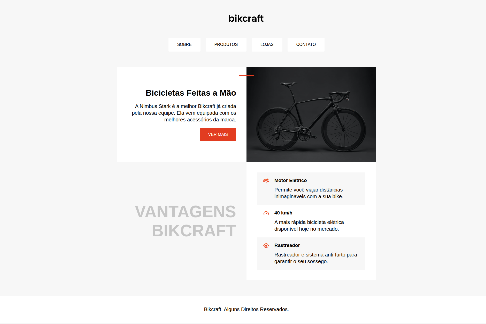
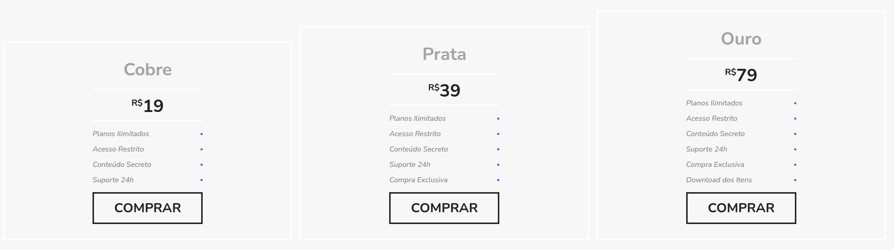

## 🚀 Sobre
Este repositório contém todos os projetos práticos desenvolvidos durante minha jornada de aprendizado na plataforma Origamid. Os projetos abrangem desde fundamentos de HTML e CSS até aplicações avançadas com JavaScript e TypeScript.

## 📂 Estrutura de Projetos

### 🎯 HTML e CSS

- [Bikcraft](bikcraft) - Site completo para uma empresa fictícia de bicicletas personalizadas

- [Flexblog](flexblog) -  Blog desenvolvido para domínio de Flexbox

